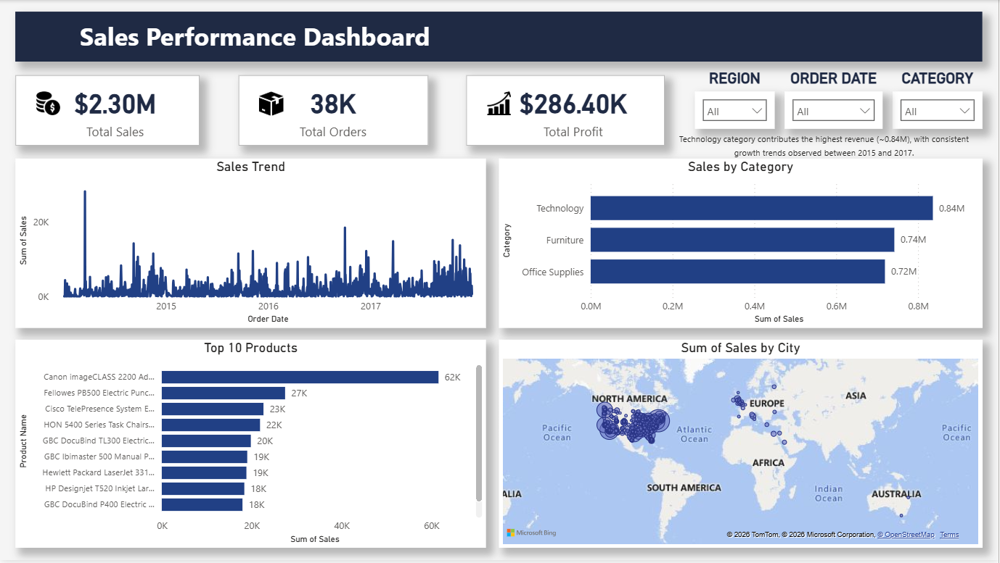

# 📊 Sales Performance Dashboard (Task 1)

## 🚀 Project Overview

This project presents an interactive **Sales Performance Dashboard** built using Power BI to analyze business data and derive meaningful insights.
It enables stakeholders to monitor key metrics, identify trends, and make data-driven decisions.

---

## 🎯 Objectives

* Analyze overall sales performance
* Identify top-performing categories and products
* Track sales trends over time
* Visualize geographic distribution of sales
* Enable dynamic filtering for deeper analysis

---

## 📌 Key Features

* 📈 **KPI Cards**: Total Sales, Total Orders, Total Profit
* 📊 **Sales Trend Analysis**: Time-based performance insights
* 🏷️ **Category-wise Comparison**: Revenue contribution by category
* 🥇 **Top 10 Products**: Best-selling products by sales
* 🗺️ **Geographic Visualization**: Sales distribution across cities
* 🎛️ **Interactive Filters**: Region, Category, and Order Date slicers

---

## 🧠 Key Insights

* Technology category contributes the highest revenue (~0.84M)
* Sales show consistent growth between 2015 and 2017
* A small set of top products drives a significant portion of total sales
* Certain regions exhibit higher sales concentration

---

## 🛠️ Tools & Technologies

* Power BI
* Data Visualization Techniques
* Superstore Dataset

---

## 📂 Project Structure

* `SalesDashboard.pbix` → Power BI dashboard file
* `dashboard.png` → Dashboard preview image
* `README.md` → Project documentation

---

## 📸 Dashboard Preview

---

## 💡 Conclusion

This dashboard provides a comprehensive view of sales performance, helping in identifying trends, high-performing segments, and actionable insights for business growth.

---

## 📬 Author

**Anirudh K N**

---
